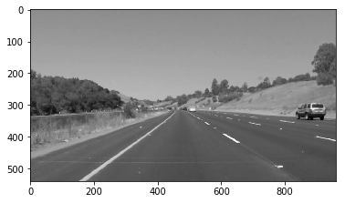
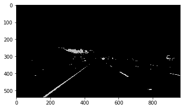
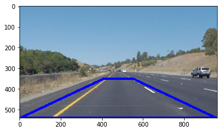
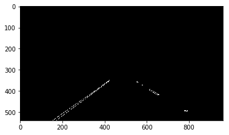
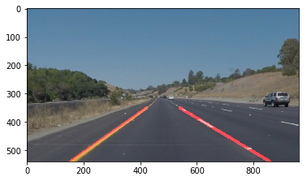

# **Finding Lane Lines on the Road** 

**Finding Lane Lines on the Road**

The goals / steps of this project are the following:
* Make a pipeline that finds lane lines on the road
* Reflect on your work in a written report

### Reflection

### 1. Describe your pipeline. As part of the description, explain how you modified the draw_lines() function.

1. Convert to greyscale in order to make it easier to detect bright areas which include lane markings

    

2. Create histogram and only keep the 1% of the brightest pixels within the image (hopefully includes lane markings)

    

3. Only consider a polygon shaped area in the region of the road (remove other pixels

    
    

4. Gaussian Blur and Canny Edge Detection

    
    
    
5. Hough Transform in order to get connected line segments of the edge-image

6. Separate the line segments into "left-lane-marking" and "right-lane-marking"  
    6.1 Use the MEDIAN slope and intercept of the left and right lane-marking in order to interpolate a linear line  
    6.2 Draw the lines from the bottom of the image (y=max) to the upper limit of the region of interest.  

    

### 2. Identify potential shortcomings with your current pipeline

Within curves, the linear line model will not fit the lane marking nicely, plus the algorithm will have a hard time to find a good match. 

Additional bright objects on the road (e.g. white trucks) will cause a lower quality detection, since bright regions are considered for lane detection. 

Only single images are considered, thus an error within a single frame can cause a wrong output. 

Most parameters are fixed and do not adapt to the current situation (e.g. weather, brightness, road situation). 

### 3. Suggest possible improvements to your pipeline

Instead of a linear fit, a polynomial fit could be used in order to be able to fit the lane markings in curves. 

Additinal features can be looked for on lanes markings, in order to discard regions not representing lane markings. 

Optimizing the parameters over time (depending on the current road situation) might siginficantely improve the performance of the algorithm. 

The videos could be annotated with the perfect solution for every frame in order to validate the performance of the current solution. The parameters can be varied in order to minimize this Error-Function and obtain perfect parametes. 

